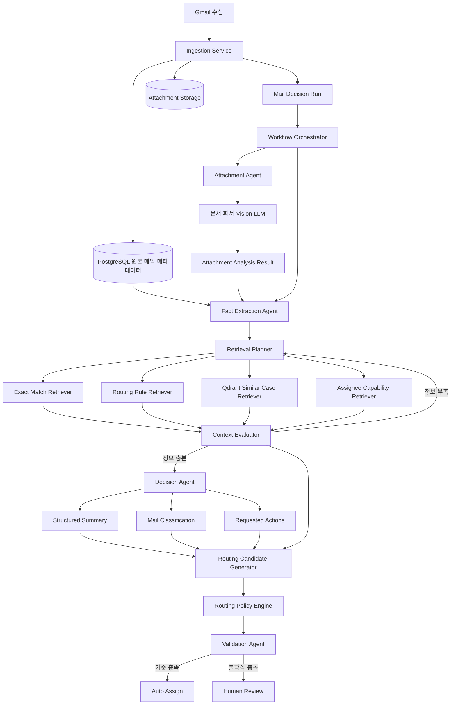

# Agentic RAG Mail Decision System

## 문서 목적

이 문서는 CoRA Mail Agent의 목표 아키텍처를 정의한다. 시스템의 최종 성공 기준은 메일을 단순 분류하는 것이 아니라, 메일 본문과 첨부파일을 함께 분석하고 조직 지식과 과거 사례를 검색해 실제 업무를 수행할 담당자에게 근거와 함께 배정하는 것이다.

이 문서는 첨부파일 분석, 사실 추출, 요약, 업무 유형 분류, 검색, 담당자 후보 생성, 검증, 사람 검토를 하나의 통합 실행으로 묶는 기준 문서다. 기능별 문서는 이 문서의 상태 모델과 데이터 계약을 따라야 한다.

Knowledge Graph와 미래 Search Agent의 역할 분리는 [Knowledge Graph Context And Search Agent](knowledge-graph-context-and-search-agent.md)를 따른다. Knowledge Graph는 우선 담당자 배정에 필요한 관계 기반 Context/Evidence retrieval 가설로 검증하며, Graph DB 제품 선택은 보류한다.

## 기존 임시 구현에 대한 판단

다음 구현은 화면과 데이터 흐름을 검증하기 위한 임시 데모이며 목표 아키텍처의 기준으로 사용하지 않는다.

- `PostgresEmailAnalysisWorker`
- 제목과 본문 키워드만 사용하는 규칙 기반 분류
- 제목과 snippet을 연결하는 요약
- `classification`, `executive_summary`를 독립 작업으로 실행하는 흐름
- 담당자 값을 `미할당`으로 고정하는 화면용 변환
- `coramail-rule-v1`을 운영 AI 결과처럼 기록하는 방식

메일 수집, 원본 저장, PostgreSQL/Qdrant 분리 원칙, 사용자 수정 이력, 받은편지함 UI 골격은 재사용할 수 있다.

## 최상위 실행 단위

하나의 메일은 하나의 `Mail Decision Run`으로 분석한다.

```text
메일 수집
→ 첨부파일 분석
→ 본문·첨부 통합 사실 추출
→ 검색 계획 수립
→ 정확 검색·규칙 검색·의미 검색
→ 검색 결과 충분성 평가 및 필요 시 재검색
→ 구조화 요약과 세부 업무 유형 판단
→ 담당자 후보 생성과 점수 계산
→ 결과 검증
→ 자동 배정 또는 사람 검토
```

요약, 분류, 담당자 배정은 서로 독립된 사실을 만들면 안 된다. 모두 동일한 `MailFacts`, `EvidenceItem`, 검색 문맥을 사용한다.

## 시스템 구성



## 구성 요소 책임

### Workflow Orchestrator

- 상태 전이, 재시도, 중복 실행 방지, 실행 재개를 담당한다.
- 자유 추론을 하지 않는 결정적 상태 머신으로 구현한다.
- 노드별 입력·출력·지연 시간·오류를 저장한다.

### Attachment Agent

- MIME, 확장자, 파일 구조를 확인하고 분석 도구를 선택한다.
- PDF 텍스트·레이아웃, 스캔 PDF/이미지 Vision 분석, XLSX 시트·표, DOCX 본문·표를 지원한다.
- 문서 유형, 구조화 필드, 표 행, 페이지와 근거 위치를 반환한다.
- `partial_success`, `failed`, `unsupported`를 정상 상태로 다룬다.

### Fact Extraction Agent

메일과 모든 첨부 결과에서 다음 업무 사실을 통합한다.

- 고객·발신자·도메인
- 요청 행동
- 제품·제품군·부품번호
- PO·견적·프로젝트·선박 식별자
- 수량·납기·긴급 신호
- 누락 정보와 본문/첨부 충돌
- 각 값의 원문 근거

### Retrieval Planner와 Context Evaluator

검색 우선순위는 다음과 같다.

1. 고객, 도메인, 제품 코드, 부품번호, 프로젝트, 선박의 정확 일치
2. 고객·제품·업무 유형·프로젝트 라우팅 규칙
3. 사용자 확정 이력이 있는 과거 유사 메일과 배정 사례
4. 활성 담당자, 역량, 대체 담당자, 업무 가능 상태

검색 결과가 부족하거나 서로 충돌하면 질의를 재작성하고 다른 도구를 호출한다. 최대 검색 반복은 3회로 제한한다.

검색 문맥 부족은 담당자 자동 배정의 차단 조건이지만, 요약과 업무 유형 분류를 항상 차단하지는 않는다. 본문과 첨부에서 근거 있는 사실이 있으면 Decision Agent는 제한된 요약과 분류를 생성하고 `review_required = true` 및 부족한 검색 문맥을 함께 기록한다. 담당자 후보 생성과 자동 배정은 충분한 조직·라우팅 문맥이 확인된 경우에만 진행한다.

### Decision Agent

동일한 사실과 근거를 바탕으로 다음을 생성한다.

- 업무 수행용 구조화 요약
- 상위 업무 영역과 세부 업무 유형
- 긴급성(`urgency`) 판단
- 요청 행동
- 누락 정보와 사람 검토 신호

업무메일 운영 화면의 우선순위는 긴급성 단일 축으로 판단한다. 긴급성은 얼마나 빨리 대응해야 하는지에 대한 시간적 축이며, 명시적 기한, 임박한 마감, 현재 장애·중단, 즉시 조치 요청처럼 사용자가 먼저 확인해야 하는 근거가 있어야 한다. 회사 업무·고객·금전·계약·안전·운영 영향은 라우팅, 검토 사유, 요약의 위험 정보로 활용할 수 있지만 별도 `importance` 우선순위 축으로 사용자에게 노출하지 않는다.

업무 유형 분류(`MailClassification`)는 상위 업무 영역과 세부 업무 유형만 표현한다. 긴급성은 별도 구조화 결과로 저장한다.

```text
urgency.level: high | normal
```

기존 `importance`와 `attention_quadrant` 저장 필드는 과거 `decision-agent:v3` 결과와 화면 row 호환을 위해 당분간 유지될 수 있으나, 신규 사용자 경험의 목표 모델은 아니다. 이후 긴급 메일 분류 안정화 단계에서 DB/API/fixture/evaluation cleanup 범위를 별도 작업으로 정리한다.

### Routing Candidate Generator

담당자 후보는 고객 전담, 제품군, 업무 유형, 프로젝트, 과거 확정 배정, 유사 사례, 활성 상태를 사용해 생성한다. LLM이 임의의 사용자를 생성해서는 안 된다.

초기 점수식은 다음을 기준으로 하며 운영 평가로 조정한다.

```text
total_score =
    customer_owner * 0.30
  + product_owner * 0.20
  + business_type * 0.20
  + project_owner * 0.10
  + historical_assignment * 0.10
  + similar_case * 0.05
  + availability * 0.05
```

명시적 예외 규칙은 점수식보다 우선한다.

### Validation Agent

- 요약의 요청 행동과 분류가 일치하는지 확인한다.
- 본문과 첨부 문서 유형의 충돌을 확인한다.
- 선택한 담당자의 역량과 조직 규칙을 확인한다.
- 근거 없이 생성된 식별자, 날짜, 수량을 탐지한다.
- 검색 사례가 현재 고객·제품·업무와 실제로 관련 있는지 확인한다.

## 업무 유형 체계

화면의 상위 영역과 담당자 배정용 세부 유형을 분리한다.

상위 영역:

- `sales`
- `order`
- `technical`
- `service`
- `finance`
- `general`

초기 세부 유형:

- `quotation_request`
- `quotation_followup`
- `purchase_order`
- `order_change`
- `order_cancellation`
- `delivery_confirmation`
- `delivery_delay`
- `technical_inquiry`
- `drawing_review`
- `specification_review`
- `compatibility_check`
- `service_request`
- `repair_request`
- `claim`
- `urgent_failure`
- `invoice`
- `payment_inquiry`
- `certificate_request`
- `general_inquiry`
- `spam`

## 자동 배정 정책

다음 조건을 모두 만족할 때만 자동 배정한다.

- 최고 후보 점수 0.82 이상
- 1위와 2위 점수 차이 0.15 이상
- 업무 유형 신뢰도 0.78 이상
- 업무 판단에 필요한 첨부파일 분석 완료
- 고객·제품·프로젝트 근거 중 하나 이상 존재
- Validation Agent가 모순 없음으로 판정
- 담당자가 active 상태

후보 없음, 점수 차이 부족, 첨부 분석 실패, 본문/첨부 충돌, 신규 고객·제품, 긴급 미확정, 복수 부서 협업 필요, 스키마 검증 실패는 사람 검토로 전환한다.

## 로컬 AI 실행 원칙

- 텍스트 LLM, Vision LLM, 임베딩, reranker를 고객 내부 환경에서 실행한다.
- 애플리케이션은 `app/llm/`의 OpenAI 호환 Gateway를 통해 모델을 호출한다.
- 개발 실행기는 Ollama를 사용할 수 있으나 운영 실행기는 GPU와 동시 처리량 평가 후 vLLM 또는 llama.cpp server를 선택한다.
- 특정 모델명은 문서에서 고정하지 않고 model registry 설정으로 교체 가능하게 둔다.

## 신규 저장 구조

### `mail_decision_runs`

메일 한 건의 전체 실행 상태, workflow version, current node, input hash, 실패 정보를 저장한다.

### `mail_decision_steps`

노드별 입력·출력, 모델·프롬프트 버전, 토큰, 지연 시간, 오류, attempt를 저장한다.

### `mail_facts`

현재 통합 업무 사실과 신뢰도, 실행 ID를 저장한다.

### `evidence_items`

본문·첨부·검색 근거의 source ID, page, bbox, text span, content hash를 저장한다.

### `retrieval_traces`

검색 목적, query, filter, source, retrieval/rerank score, 최종 prompt 포함 여부를 저장한다.

### `routing_candidates`

후보별 세부 점수, 순위, 근거를 저장한다.

### `assignee_capabilities`

사용자별 고객, 제품군, 업무 유형, 프로젝트, 우선순위와 유효 기간을 저장한다.

## 가상 개발 데이터

실제 조직·수신 메일 데이터가 부족한 동안 다음 합성 데이터를 구축한다.

- 담당자 8명
- 고객사 12개
- 제품군 6개
- 선박·프로젝트 15개
- 라우팅 규칙 40개
- 수신 메일 200건
- 첨부파일 120개
- 정답 담당자와 근거가 있는 평가 사례 100건

합성 데이터에는 스캔 발주서, 다중 시트 Excel, 본문/첨부 충돌, 신규 고객, 후보 동점, 비활성 담당자, 긴급 오탐, 첨부 실패를 포함한다.

## 평가 기준

다음 기준은 합성 평가셋과 실제 운영 평가를 분리해 해석한다. 합성 데이터 기반 결과는 schema, workflow, regression, demo 검증에는 사용할 수 있지만 실제 담당자 배정 정확도나 운영 성능 주장으로 사용하지 않는다. 운영 성능은 실제 수신 메일과 담당자 처리 이력을 확보한 뒤 별도 평가한다.

핵심 지표:

- 첨부 문서 유형 정확도
- 필드·표 추출 F1
- 요청 행동과 업무 식별자 포함률
- 세부 업무 유형 macro F1
- 담당자 Top-1 정확도
- 담당자 Top-3 recall
- 자동 배정 precision
- 사람 검토 전환 recall
- 사용자 재배정률
- 근거 없는 생성 사실 비율

초기 합격 기준:

- 첨부 문서 유형 정확도 90% 이상
- 핵심 필드 평균 F1 85% 이상
- 세부 업무 유형 macro F1 85% 이상
- 담당자 Top-1 정확도 85% 이상
- 담당자 Top-3 recall 95% 이상
- 자동 배정 precision 95% 이상
- 긴급 메일 오배정률 2% 이하
- 근거 없는 생성 사실 비율 1% 이하

## 구현 단계

1. 기존 규칙 Worker를 운영 경로에서 제거하고 Mail Decision Run 상태 모델을 구현한다.
2. 로컬 LLM Gateway와 구조화 출력 검증을 연결한다.
3. PDF, 이미지, XLSX, DOCX 첨부 분석을 구현한다.
4. 통합 사실 추출, 요약, 세부 업무 유형 분류를 구현한다.
5. 합성 담당자·고객·제품·프로젝트·평가 데이터를 구축한다.
6. 정확 검색, 규칙 검색, Qdrant 검색, reranker, 검색 반복을 구현한다.
7. 담당자 후보 계산, 검증, 자동 배정과 사람 검토를 구현한다.
8. 단계별 평가, trace, 프롬프트·모델 버전 관리를 운영 수준으로 강화한다.
